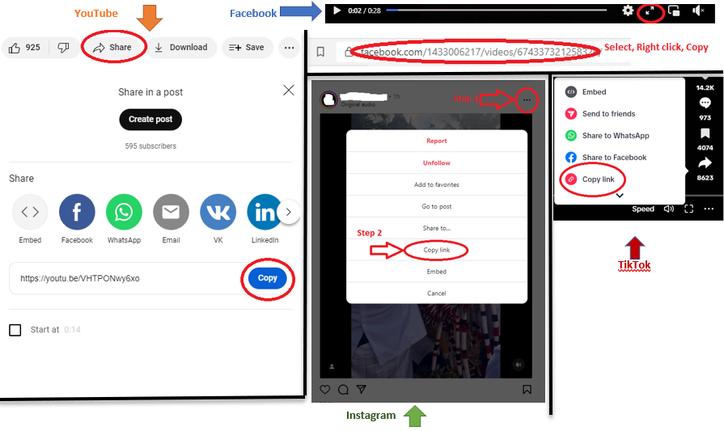

# Ultimate downloader
---
### Download video files, or any type of file finded on website.
Video media download is based you **YT-DLP** and video to audio conversion is based on **FFmpeg**.
Those two packages are provided by the **Scoop** or **Chocholatey** package provider.
##### For more help details click on 'Help' button on application.
Usage:
---
##### First step:
Click on Install button to install the **Scoop** or **Chocolatey** package provider and **YT-DLP** and **FFmpeg**.
##### Search and download file(s) from web:
Just paste any valid WEB link to **Ultimate downloader**'s browser 'URL' navigation bar and don't press Enter or click the 'Go' button if you are sure that it is the correct link to the website you want to search or download the file(s).
To start searching file(s) just type the filenae on 'search' field and press Enter or click the 'Search' button. You can use wildcards to find files. Finally, select the file and click 'Download'.
##### Download video media file from web:
Just paste the web link where you watch the video clip and click 'Download' at 'Download Video media' section, or if you're unsure it is correct link press enter after you paste the link or click 'Go' button, **Ultimate downloader** will automatically determine if it is a video media link.
You can download from **YouTube**, **Facebook**, **TikTok**, **Instagram**, **xHamster** (WARRNING - only if you are an adult!), or any other compatible Tube, you can test it.
The example's how to get video media link are on the below picture:

Developed by:
---
**by chixus - CHXOFT @2023. (Ivan Benišек)
Serbia - Belgrade.**
